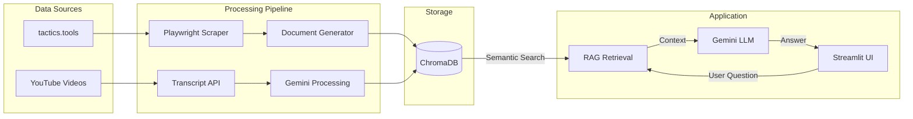

# TFT Meta Mind

**A RAG chatbot that knows the current Teamfight Tactics meta — backed by daily-scraped stats and YouTube creator insights.**

[](https://python.org)
[](LICENSE)
[](https://tftmetamind.duckdns.org)

<video src="https://github.com/user-attachments/assets/e9713a6c-fc1b-40d5-8fc3-73f8487dcec0" controls width="100%"></video>

---

## Why This Exists

Most TFT tier lists are static images that go stale within a day. Players need up-to-date, specific answers: *"What items on Yone?"*, *"Is this comp still good after the hotfix?"*, *"How do I transition from a Mage opener?"*

TFT Meta Mind solves this by combining a **daily automated data pipeline** (scraping high-elo stats from [tactics.tools](https://tactics.tools) and extracting strategy from YouTube creators) with a **RAG chatbot** (Gemini 2.5 Flash + ChromaDB) that can answer those questions with grounded, citation-backed responses.

The interesting engineering problem is making retrieval smart enough to route different question types to the right knowledge — comp questions need stats, strategy questions need creator advice, and unit questions need item builds. A keyword classifier + metadata-filtered vector search handles this without fine-tuning.

---

## Architecture



**Data flows through five daily pipeline steps:** scrape tactics.tools via Playwright → generate natural-language documents → ingest into ChromaDB with header-based chunking → ingest pre-processed YouTube docs → clean up old files. The chatbot classifies incoming questions (comp / unit / strategy / ambiguous) and routes retrieval to the most relevant document types before generating a grounded answer.

For the full technical deep-dive, see [`tft_meta_mind_blueprint.md`](tft_meta_mind_blueprint.md).

---

## Tech Stack

| Category | Technology |
|----------|-----------|
| **AI / LLM** | Gemini 2.5 Flash (google-genai) |
| **Vector DB** | ChromaDB (all-MiniLM-L6-v2 embeddings) |
| **Scraping** | Playwright (headless Chromium), youtube-transcript-api |
| **Frontend** | Streamlit |
| **Deployment** | AWS Lightsail, Docker Compose, GitHub Actions CI/CD |
| **Data Sources** | Riot Data Dragon CDN, tactics.tools, YouTube |

---

## Getting Started

### Prerequisites

- Python 3.11+
- A [Google AI Studio](https://aistudio.google.com/) API key (Gemini)

### Setup

```bash
git clone https://github.com/victorxia18/tft-meta-mind.git
cd tft-meta-mind
python -m venv .venv && source .venv/bin/activate  # or .venv\Scripts\activate on Windows
pip install -r requirements.txt
playwright install chromium
```

### Configure environment

```bash
cp .env.example .env
# Edit .env and add your GEMINI_API_KEY
```

### Run the pipeline and UI

```bash
# Scrape data + generate docs + ingest into vector store
python -m pipeline.daily_run --once

# Launch the web UI
streamlit run streamlit_app.py
```

### Optional: ingest YouTube videos

```bash
# Process YouTube videos locally (transcripts are blocked from cloud IPs)
python -m pipeline.daily_run --youtube-file config/youtube_sources.txt
```

---

## Project Structure

```
tft-meta-mind/
├── chatbot/app.py              # Gemini RAG chatbot with keyword-based retrieval routing
├── scraper/
│   ├── tactics_tools.py        # Playwright scraper (Next.js __NEXT_DATA__ extraction)
│   └── youtube.py              # YouTube transcript fetch + Gemini strategy extraction
├── pipeline/
│   ├── daily_run.py            # 5-step pipeline orchestrator (APScheduler)
│   └── document_generator.py   # Raw JSON → natural language docs for RAG
├── rag/vector_store.py         # ChromaDB wrapper (## header chunking, deterministic IDs)
├── ui/
│   ├── components.py           # HTML renderers (header, welcome message)
│   └── styles.py               # Custom CSS theme
├── utils/data_dragon.py        # Riot Data Dragon CDN (ID → champion/item/trait names)
├── config/youtube_sources.txt  # YouTube URLs for batch ingestion
├── data/
│   ├── raw/                    # Scraped JSON (gitignored, auto-cleaned after 7 days)
│   └── youtube_docs/           # Pre-processed YouTube documents (git-tracked)
├── streamlit_app.py            # Web UI entry point
├── docker-compose.yml          # Two-container deployment (streamlit + pipeline)
├── Dockerfile
└── .github/workflows/deploy.yml
```

---

## Key Design Decisions

- **Header-based chunking** — documents split on `## ` markdown headers to keep each comp/unit as a single semantic chunk, with sub-splitting on `### ` for oversized sections. Produces better retrieval than arbitrary word-count splits.
- **Keyword routing** — regex classifiers detect question intent and filter retrieval by document type before embedding similarity kicks in. Pure similarity struggled with obvious-intent questions like *"what items on Fizz"*.
- **Deterministic chunk IDs** — `MD5(type_date_sourceId_index)` means re-running the pipeline upserts instead of duplicating. Safe to re-run at any time.
- **Two-stage YouTube pipeline** — YouTube blocks transcript API from cloud IPs, so video processing runs locally, saves JSON to `data/youtube_docs/`, and the server-side pipeline just ingests the files.

---

## Future Plans

- **Twitter/X meta signal ingestion** — track what top players are saying about the meta in real-time
- **Personal match history tracking** via Riot API — personalized advice based on your recent games
- **Meta shift detection and alerts** — notifications when comp win rates change significantly between patches

---

## Built By

**[Victor Xia](https://github.com/victorxia18)**

---

<sub>TFT Meta Mind isn't endorsed by Riot Games and doesn't reflect the views or opinions of Riot Games or anyone officially involved in producing or managing Riot Games properties. Riot Games, and all associated properties are trademarks or registered trademarks of Riot Games, Inc.</sub>
