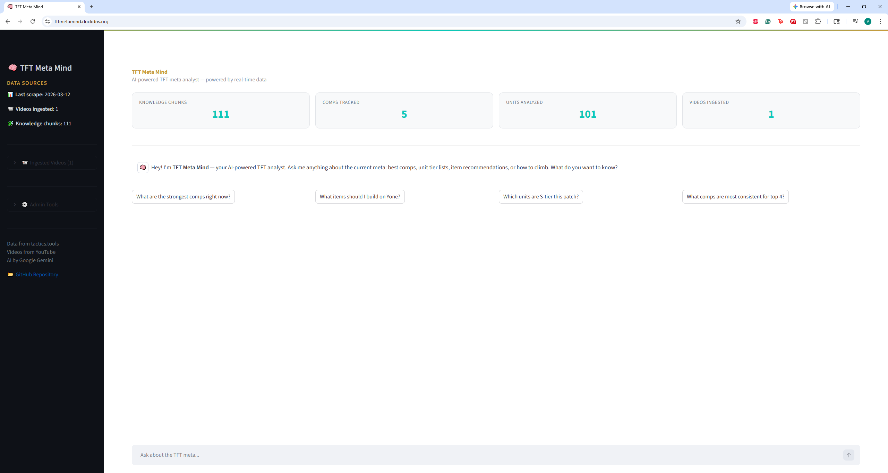
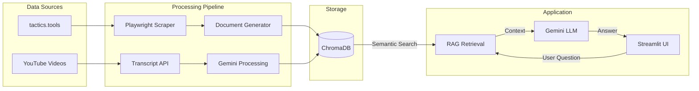

# 🧠 TFT Meta Mind

**An AI-powered Teamfight Tactics meta analyst that combines real-time stats, YouTube creator insights, and RAG to answer any TFT question.**

[](https://python.org)
[](LICENSE)
[](https://tftmetamind.duckdns.org)


<!-- TODO: Add actual screenshot -->

---

## What It Does

TFT Meta Mind is a **RAG chatbot** that knows the current TFT meta. It combines daily-scraped stats from [tactics.tools](https://tactics.tools), strategic advice extracted from YouTube creator videos, and semantic search to give grounded, actionable answers.

Ask it what comps are strong, how to itemize a unit, or what to play from a specific opener — and get answers backed by real data and pro player insights.

---

## Architecture



---

## Key Features

- **Daily automated meta scraping** from tactics.tools via Playwright
- **YouTube transcript ingestion** with LLM-powered strategic insight extraction
- **Semantic search** over a TFT knowledge base (ChromaDB vector store)
- **Smart retrieval routing** — comp questions, unit questions, and strategy questions each get tailored context
- **Deployed on AWS Lightsail** with Docker Compose + GitHub Actions CI/CD
- **Multi-turn conversation** with context-aware follow-ups

---

## Tech Stack

| Category | Technology |
|----------|-----------|
| **AI / LLM** | Gemini 2.5 Flash (google-genai) |
| **Vector DB** | ChromaDB |
| **Scraping** | Playwright, youtube-transcript-api |
| **Frontend** | Streamlit |
| **Deployment** | AWS Lightsail, Docker Compose, GitHub Actions |
| **Data Sources** | Riot Games Data Dragon, tactics.tools, YouTube |

---

## Getting Started

```bash
# Clone and setup
git clone https://github.com/victorxia18/tft-meta-mind.git
cd tft-meta-mind
python -m venv .venv && source .venv/bin/activate  # or .venv\Scripts\activate on Windows
pip install -r requirements.txt
playwright install chromium

# Configure environment
cp .env.example .env  # Add your GEMINI_API_KEY

# Run the pipeline (scrape + generate docs + ingest)
python -m pipeline.daily_run --once

# Launch the UI
streamlit run streamlit_app.py
```

---

## Project Structure

```
tft-meta-mind/
├── chatbot/            # Gemini RAG chatbot with smart retrieval routing
├── scraper/            # Playwright scraper + YouTube transcript fetcher
├── pipeline/           # Daily orchestration (APScheduler) + document generator
├── rag/                # ChromaDB vector store wrapper
├── utils/              # Riot Data Dragon CDN lookups (ID → name)
├── config/             # YouTube source URLs
├── data/
│   ├── raw/            # Scraped JSON data (gitignored)
│   └── youtube_docs/   # Pre-processed YouTube documents (git-tracked)
├── streamlit_app.py    # Web UI entry point
├── docker-compose.yml  # Multi-container deployment config
└── .github/workflows/  # CI/CD pipeline
```

---

## How It Works

**Data Collection:** A daily pipeline scrapes comp and unit statistics from tactics.tools using Playwright. YouTube creator videos are processed locally — transcripts are fetched, then Gemini extracts strategic insights (opener guides, transition paths, itemization advice) into structured documents.

**Knowledge Storage:** All documents are chunked by section (one comp or unit per chunk) and embedded into ChromaDB. Deterministic IDs ensure re-running the pipeline updates existing data rather than creating duplicates.

**RAG Retrieval:** When a user asks a question, the system classifies it (comp question? unit question? strategy question?) and routes retrieval accordingly — pulling from the most relevant document types. Gemini then generates an answer grounded in the retrieved context, citing specific stats and creator sources.

For the full technical spec, see [`tft_meta_mind_blueprint.md`](tft_meta_mind_blueprint.md).

---

## Future Plans

- 🐦 **Twitter/X meta signal ingestion** — track what top players are saying about the meta in real-time
- 📊 **Personal match history tracking** via Riot API — get personalized advice based on your recent games
- 🔔 **Meta shift detection and alerts** — get notified when comp win rates change significantly between patches

---

## Built By

**[Victor Xia](https://github.com/victorxia18)**

---

<sub>TFT Meta Mind isn't endorsed by Riot Games and doesn't reflect the views or opinions of Riot Games or anyone officially involved in producing or managing Riot Games properties. Riot Games, and all associated properties are trademarks or registered trademarks of Riot Games, Inc.</sub>
